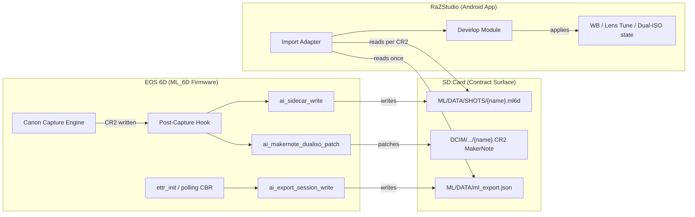
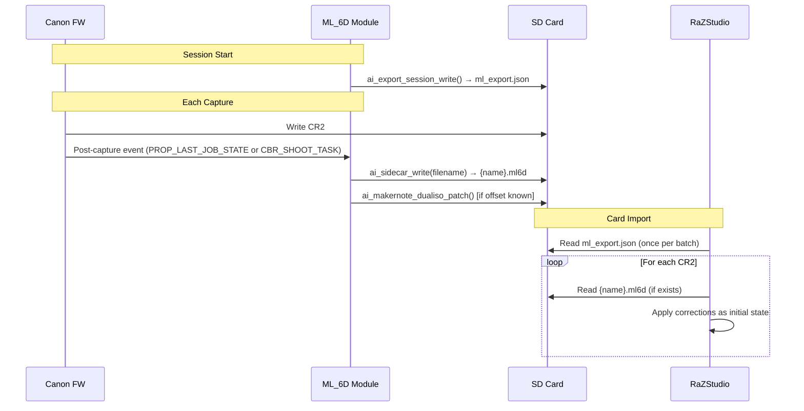

# Design Document: RaZStudio Integration

## Overview

This design documents the integration contract between the ML_6D firmware
(EOS 6D Magic Lantern fork) and RaZStudio (companion Android RAW processor).
The firmware writes per-shot `.ml6d` sidecars and a per-session
`ml_export.json` to the SD card at capture time; RaZStudio reads them at
import time to apply AI-derived corrections (white balance, lens tuning,
dual-ISO detection) automatically.

The firmware side is largely implemented in `source-dev/modules/ettr/ai_lut.h`
(`ai_sidecar_write()`, `ai_export_session_write()`,
`ai_makernote_dualiso_patch()`). This design addresses:

1. **Call-site fix** (REQ-001): making `ai_sidecar_write()` fire on every
   capture, not only ETTR shots.
2. **Dual-ISO offset resolution** (REQ-002): either finding the real
   MakerNote offset or explicitly deferring with a sidecar field.
3. **Contract documentation** (REQ-003, REQ-004): exact JSON schemas for
   both contract files.
4. **RaZStudio import adapter contract** (REQ-005): how the consumer
   parses, applies, and degrades.
5. **End-to-end validation** (REQ-006): proving the pipeline works on
   real hardware.

**Key design decision:** The file format IS the API. No shared code, no
repo coupling. Schema versioning handles firmware/consumer drift.

## Architecture

### Component Diagram



### Data Flow (Capture → Import)



## Components and Interfaces

### Component 1: Call-Site Fix (REQ-001)

**Problem:** `ai_sidecar_write()` is only called from
`auto_ettr_photo_task()` (ettr.c:986), which only runs when ETTR is
enabled. Non-ETTR shots get no sidecar.

**Strategy:** Hook `ai_sidecar_write()` into a capture-complete event
that fires for ALL photos regardless of ETTR state.

**Why the existing code doesn't already do this:** The comment at
`ettr.c:1003-1008` states: *"no dedicated capture-complete hook
(independent of ETTR) was found in this codebase."* Investigation shows
this comment is **misleading** -- `CBR_POST_SHOOT` (module.h:36) exists
and is already registered by the Lua module (`lua.c:1429`) for its
`post_shoot` event. The ETTR module simply never registered it; the
comment was written from the ETTR module's local perspective (its own CBR
table only has `CBR_VSYNC_SETPARAM`, `CBR_KEYPRESS`, `CBR_SHOOT_TASK`).
There is no evidence the hook was tried and rejected -- it was overlooked.

**Available hooks in ML_6D (from codebase analysis):**

| Hook | Fires when | Already used by | Suitability |
|------|-----------|-----------------|-------------|
| `CBR_POST_SHOOT` | After image taken (module.h:36) | Lua module (`lua.c:1429`) | ✓ Proven per-capture hook |
| `CBR_SHOOT_TASK` | Periodically from shoot task | ETTR module (polling) | ✗ Polling, not per-shot |
| `PROP_LAST_JOB_STATE` | Property 0x80030012 changes | — | ✓ Alternative -- `job_state==0` means card write complete |

**Chosen approach:** Register `CBR_POST_SHOOT` in the ETTR module's CBR
table. This fires after every image is taken. The Lua module already
proves this hook works reliably for per-capture callbacks. The handler
calls `ai_sidecar_write()` with the current `file_number`.

**Risk mitigation:** The existing `ettr.c:1003-1008` comment must be
updated or removed during implementation to avoid future confusion. If
on-device testing reveals that `CBR_POST_SHOOT` fires before the CR2
file is fully closed (a timing concern, since the Lua module uses it for
non-file-writing purposes), the fallback is `PROP_LAST_JOB_STATE` with
a `job_state==0` guard, which fires after the card write completes.

**Deduplication guard (REQ-001 AC2):** The existing call in
`auto_ettr_photo_task()` at ettr.c:986 is removed. The new
`CBR_POST_SHOOT` handler becomes the single call site for
`ai_sidecar_write()`. This eliminates any double-write risk since:
- `CBR_POST_SHOOT` fires once per capture (guaranteed by ML core)
- The ETTR task no longer calls it independently

**Implementation sketch:**

```c
/* New: post-capture CBR handler -- fires for ALL captures */
static unsigned int ai_post_capture_cbr(unsigned int ctx)
{
    struct card_info * card = get_shooting_card();
    if (!card) return 0;

    /* Strip .CR2 extension to get clean basename for sidecar path.
     * Current code bug: passes full "IMG_NNNN.CR2" to ai_sidecar_write()
     * which appends ".ml", producing "IMG_NNNN.CR2.ml" (double extension).
     * Fix: construct basename without extension. */
    char basename[16];
    snprintf(basename, sizeof(basename), "IMG_%04d", card->file_number);

    char cr2_name[16];
    snprintf(cr2_name, sizeof(cr2_name), "IMG_%04d.CR2", card->file_number);

    ai_sidecar_write(basename);  /* produces ML/DATA/SHOTS/IMG_NNNN.ml6d */

    if (AI_MKNOTE_DUALISO_OFFSET_TODO > 0)
        ai_makernote_dualiso_patch(cr2_name, AI_MKNOTE_DUALISO_OFFSET_TODO);

    return 0;
}

/* In MODULE_CBRS (add to existing block at ettr.c:2308-2312): */
MODULE_CBR(CBR_POST_SHOOT, ai_post_capture_cbr, 0)
```

**Note on `AI_MKNOTE_DUALISO_OFFSET_TODO`:** The implementation sketch
uses the current `#define` name (`_TODO` suffix) which is the one present
at `ettr.c:966` and referenced at `ettr.c:987-988`. If/when the real
offset is determined, both the `#define` and both usage sites must be
updated together (rename to `AI_MKNOTE_DUALISO_OFFSET` or assign the
real value).

**Conditional field emission (REQ-001 AC3):** `ai_sidecar_write()` already
handles this correctly -- the `"ettr"` block is only emitted when
`auto_ettr` is true (guarded by `if (auto_ettr) { ... }`). No change
needed to the writer itself.

### Component 2: Dual-ISO Offset Resolution (REQ-002)

**Problem:** `AI_MKNOTE_DUALISO_OFFSET_TODO` (ettr.c:966) is hardcoded
to `0`, making `ai_makernote_dualiso_patch()` a permanent no-op.
The `_TODO` suffix signals this was always a placeholder.

**Resolution strategy (two-path):**

1. **Attempt offset discovery:** Use `exiftool -v3 -canon` on a real
   dual-ISO CR2 from the EOS 6D (files in `recovered_photos/`) to locate
   the MakerNote IFD entry for a suitable unused SHORT tag. If found,
   assign the verified offset value to `AI_MKNOTE_DUALISO_OFFSET_TODO`
   (and optionally rename the define to drop the `_TODO` suffix, updating
   both usage sites at ettr.c:987-988 and the new `ai_post_capture_cbr`).

2. **If offset cannot be determined:** Keep the define at `0` (patch
   remains a no-op) and add explicit signaling in the `.ml6d` sidecar:
   ```json
   "dualIsoPatch": "unsupported"
   ```
   This tells RaZStudio: "dual-ISO was active for this shot, but the
   MakerNote was NOT patched -- use the sidecar's `dualIso` block for
   detection instead of looking in the CR2 EXIF."

**Sidecar field logic:**

```c
/* In ai_sidecar_write(), after the dualIso block: */
if (AI_MKNOTE_DUALISO_OFFSET_TODO == 0)
{
    /* Signal to consumer that MakerNote patch is unavailable */
    add = snprintf(..., ",\"dualIsoPatch\":\"unsupported\"");
}
else
{
    add = snprintf(..., ",\"dualIsoPatch\":\"applied\"");
}
```

**Documentation:** If left unsupported, `docs/VALIDATION.md` will note:
> Dual-ISO MakerNote patch: UNSUPPORTED on EOS 6D (offset TBD).
> RaZStudio uses the .ml6d sidecar `dualIso` block for detection.

### Component 3: Session Export Writer (REQ-004)

**Existing implementation:** `ai_export_session_write()` in `ai_lut.h`
already writes `ML/DATA/ml_export.json` with the correct structure. It is
called:
- Once at module init (`ettr_init()`, ettr.c:2294)
- On state change from the `CBR_SHOOT_TASK` polling loop (ettr.c:1970)

**Changes required:** The existing `snprintf` format string in
`ai_export_session_write()` does NOT emit a `"schema_version"` field --
it only emits `"formatVersion":2`. This spec adds `schema_version` as the
canonical versioning contract field for RaZStudio consumers (Properties
1, 2, 5 depend on it). The format string must be updated to include
`"schema_version":"2.0"` in the JSON output.

**Implementation change (ai_lut.h, ai_export_session_write):**

```c
/* Add schema_version to the format string: */
int len = snprintf(json, sizeof(json),
    "{\"formatVersion\":2,\"schema_version\":\"2.0\","
    "\"firmwareVersion\":\"%s\",\"body\":\"%s\","
    /* ... rest unchanged ... */
```

Similarly, `ai_sidecar_write()` must emit `"schema_version":"2.0"` in
its JSON output for consistency with the contract (Property 1 requires
it).

**No structural/behavioral changes** to when or how the writers are
called. Only the emitted JSON content changes (additive field).

### Component 4: RaZStudio Import Adapter (REQ-005)

**Interface contract (Kotlin pseudocode):**

```kotlin
class Ml6dImportAdapter {
    /**
     * Called once per SD-card import batch.
     * Returns session metadata or null (degraded mode).
     */
    fun loadSession(cardRoot: File): Ml6dSession?

    /**
     * Called per CR2. Returns per-shot corrections or null (default processing).
     */
    fun loadSidecar(cr2File: File): Ml6dSidecar?

    /**
     * Apply corrections to a DevelopState. Non-destructive:
     * all values are initial/overridable, never baked.
     */
    fun applyCorrections(
        state: DevelopState,
        session: Ml6dSession?,
        sidecar: Ml6dSidecar?
    ): DevelopState
}
```

**Degradation rules (REQ-005 AC4):**

| Condition | Behavior |
|-----------|----------|
| `ml_export.json` missing | Entire batch uses default processing; user notice |
| `ml_export.json` unparseable | Same as missing |
| `ml_export.json` unknown schema_version major | Same as missing |
| `.ml6d` sidecar missing | That CR2 uses default processing (no notice) |
| `.ml6d` sidecar unparseable | Same as missing sidecar |
| `.ml6d` unknown schema_version major | Same as missing sidecar |
| `dualIsoPatch: "unsupported"` | Single-ISO CR2 handling for that shot |
| Partial fields in sidecar | Apply what's present, default the rest |

**Correction application (REQ-005 AC2, AC3):**

- **WB multipliers:** Sidecar `lens.wbR`, `lens.wbB` (when present) →
  `DevelopState.initialWb`. User can override in the develop UI exactly
  like any other WB source (shot WB, custom, preset).
- **Lens tune:** Session `lensTune.contrast`, `.saturation`, `.colorTone`
  → `DevelopState.initialPictureStyle`. Non-destructive starting point.
- **Dual-ISO:** Sidecar `dualIso.enabled:true` + base/alt ISOs → flags
  the CR2 for dual-ISO demosaic in the rendering pipeline.

## Data Models

### `.ml6d` Sidecar Schema (formatVersion: 2)

Written by `ai_sidecar_write()`. One file per CR2 capture.
Path: `ML/DATA/SHOTS/{CR2_BASENAME}.ml6d`

**Required code changes to achieve this path:**
1. Rename extension: change `"%s/%s.ml"` → `"%s/%s.ml6d"` in
   `ai_sidecar_write()` (`ai_lut.h:822`).
2. Fix basename: the caller must pass `"IMG_NNNN"` (without `.CR2`),
   not the full filename `"IMG_NNNN.CR2"`. Current code passes the
   full filename, producing a double-extension `IMG_NNNN.CR2.ml`.
   The new `ai_post_capture_cbr` (Component 1) constructs the basename
   correctly before calling `ai_sidecar_write()`.
3. Update `AI_SIDECAR_DIR` define if needed (currently
   `"ML/DATA/SHOTS"` — correct, no change).

```json
{
  "formatVersion": 2,
  "schema_version": "2.0",
  "filename": "IMG_5290.CR2",
  "lens": {
    "id": 254,
    "caStrength": 30,
    "fringeReduce": 15
  },
  "pictureStyle": "STANDARD",
  "dualIso": {
    "enabled": true,
    "isoBase": 100,
    "isoAlternate": 1600,
    "interleavePeriod": 2
  },
  "ettr": {
    "lightLevel": 180,
    "sceneDR": 11.2,
    "highlightHeadroom": 0.8,
    "channelClip": [0.950, 0.920, 0.985]
  },
  "dualIsoPatch": "unsupported"
}
```

**Field presence rules:**

| Field | Present when |
|-------|-------------|
| `formatVersion` | Always |
| `schema_version` | Always (added by this spec) |
| `filename` | Always |
| `lens` | Always (lens_info always available) |
| `pictureStyle` | Always |
| `dualIso` | Only when dual-ISO enabled AND active for this shot |
| `ettr` | Only when ETTR (`auto_ettr`) is enabled |
| `dualIsoPatch` | Always (signals whether MakerNote was patched) |

**Schema version semantics:**
- Format: `"<major>.<minor>"` string
- Major bump = breaking field removal/rename. Consumer MUST reject.
- Minor bump = additive fields. Consumer SHOULD accept gracefully.

### `ml_export.json` Session Schema (formatVersion: 2)

Written by `ai_export_session_write()`. One file per session.
Path: `ML/DATA/ml_export.json`

```json
{
  "formatVersion": 2,
  "schema_version": "2.0",
  "firmwareVersion": "magiclantern-Nightly.2024Jul01.6D116",
  "body": "Canon EOS 6D",
  "sensor": {
    "pixelPitch": 6.54,
    "cropFactor": 1.0
  },
  "session": {
    "dualIsoEnabled": false,
    "ettrEnabled": true,
    "pictureStyle": "NEUTRAL"
  }
}
```

**Field presence:** All fields always present. `session` reflects the
state at time of last write (re-exported on any toggle change via the
polling CBR).

**Note:** The `schema_version` field is new (added by this spec). The
existing `formatVersion: 2` integer is retained for backward
compatibility with any early test builds; `schema_version` is the
canonical version consumers should check.

### `lens_tune.tbl` Format (reference, not modified)

9-column pipe-delimited file used by `ai_lens_tune_load()`:
```
lens_id|contrast|saturation|color_tone|ev_bias_8ths|wb_r_trim|wb_b_trim|ca_strength|fringe_reduce
254|1|-1|0|-8|980|1050|30|15
0|0|0|0|0|1024|1024|0|0  # default fallback
```

RaZStudio does NOT read this file directly. The firmware bakes the
relevant per-lens values into the session export and sidecar at write
time.

## Correctness Properties

*A property is a characteristic or behavior that should hold true across
all valid executions of a system -- essentially, a formal statement about
what the system should do. Properties serve as the bridge between
human-readable specifications and machine-verifiable correctness
guarantees.*

### Property 1: Sidecar writer produces valid, complete JSON

*For any* valid firmware state (any combination of ETTR enabled/disabled,
dual-ISO enabled/disabled, any lens ID, any picture style), calling the
sidecar write logic SHALL produce output that:
- Parses as valid JSON
- Contains a `schema_version` field matching `"2.0"`
- Contains `formatVersion`, `filename`, `lens`, `pictureStyle` fields
- Contains `ettr` block if and only if ETTR is enabled
- Contains `dualIso` block if and only if dual-ISO is enabled and active
- Contains `dualIsoPatch` field always

**Validates: Requirements 1.3, 3.2, 3.3, 3.4**

### Property 2: Session export produces valid, complete JSON

*For any* valid session state (any firmware version string, any body
name, any combination of dualIsoEnabled/ettrEnabled/pictureStyle),
calling the session export logic SHALL produce output that:
- Parses as valid JSON
- Contains `schema_version`, `formatVersion`, `firmwareVersion`, `body`,
  `sensor`, and `session` fields
- `sensor.pixelPitch` and `sensor.cropFactor` are positive numbers
- `session` contains boolean `dualIsoEnabled`, boolean `ettrEnabled`,
  and string `pictureStyle`

**Validates: Requirements 4.2**

### Property 3: Sidecar path follows naming convention

*For any* valid CR2 filename string (matching `IMG_\d{4}\.CR2`), the
constructed sidecar path SHALL equal
`ML/DATA/SHOTS/{basename_without_extension}.ml6d`.

**Current code bug:** `ai_sidecar_write()` at `ai_lut.h:822` does:
```c
snprintf(path, sizeof(path), "%s/%s.ml", AI_SIDECAR_DIR, cr2_filename);
```
where `cr2_filename` = `"IMG_5290.CR2"`, producing the double-extension
path `ML/DATA/SHOTS/IMG_5290.CR2.ml`. The fix requires TWO changes:
1. The caller (new `ai_post_capture_cbr`) must pass the basename without
   `.CR2` extension (i.e. `"IMG_5290"`, not `"IMG_5290.CR2"`).
2. The format string in `ai_sidecar_write()` must change from `"%s/%s.ml"`
   to `"%s/%s.ml6d"` (extension rename per REQ-003).

After both fixes, the output path becomes:
`ML/DATA/SHOTS/IMG_5290.ml6d` — matching this property.

**Validates: Requirements 3.1**

### Property 4: Import adapter graceful degradation

*For any* combination of contract file states (ml_export.json
missing/malformed/unknown-version, .ml6d sidecar
missing/malformed/unknown-version, dualIsoPatch set to "unsupported"),
the import adapter SHALL:
- Complete without throwing an exception or blocking
- Return a valid DevelopState (possibly with all-default values)
- Never apply corrections from unparseable/version-rejected data

**Validates: Requirements 2.4, 3.5, 4.4, 5.4**

### Property 5: Schema version rejection

*For any* contract file (sidecar or session) whose `schema_version` has
a major version greater than the consumer's known maximum, the parser
SHALL reject (ignore) the file entirely and fall back to default
processing, rather than attempting to parse fields that may have changed
semantics.

**Validates: Requirements 3.3**

### Property 6: Non-destructive correction application

*For any* valid sidecar WB multipliers and session lens-tune values,
applying them via the import adapter SHALL produce a DevelopState where:
- The WB values equal the sidecar's multipliers (not baked/composited
  with other values)
- The lens-tune values equal the session's contrast/saturation/tone
- Both are tagged as "initial" (overridable), not "locked"

**Validates: Requirements 5.2, 5.3**

## Error Handling

### Firmware Side (Writer)

| Failure Mode | Handling | User Impact |
|-------------|----------|-------------|
| `FIO_CreateDirectory` fails | Sidecar write skipped silently | No sidecar for that shot; RaZStudio degrades |
| `FIO_CreateFile` fails for sidecar | Skip silently (existing behavior) | Same as above |
| `FIO_CreateFile` fails for session | Retry once after 1s; `NotifyBox` on 2nd failure | Non-blocking notice; session file may be stale |
| `snprintf` buffer overflow | Write skipped (length check already present) | No sidecar/session written |
| `lens_info` unavailable | Sidecar written with `lens.id: 0` (default row) | RaZStudio uses default lens tune |
| `file_number` unavailable (card==NULL) | CBR returns early, no sidecar | Shot still captured; no metadata |
| Card full / write error | FIO calls fail; same as CreateFile failure | Silent skip |

**Design principle:** The firmware NEVER blocks or delays capture for
metadata export. All failures are silent or non-blocking notifications.
A failed sidecar write is acceptable; a delayed shutter release is not.

### Consumer Side (RaZStudio Import Adapter)

| Failure Mode | Handling | User Impact |
|-------------|----------|-------------|
| `ml_export.json` not found | `loadSession()` returns null | Batch imports with defaults; non-blocking toast |
| `ml_export.json` parse error | Same as not found | Same |
| `ml_export.json` unknown major version | Same as not found | Same |
| `.ml6d` not found for a CR2 | `loadSidecar()` returns null | That CR2 uses default processing (silent) |
| `.ml6d` parse error | Same as not found | Same |
| `.ml6d` unknown major version | Same as not found | Same |
| `dualIsoPatch: "unsupported"` | Skip MakerNote-based dual-ISO detection | Use sidecar `dualIso` block if present |
| Partial fields in sidecar | Apply present fields; default others | Best-effort corrections |
| File I/O exception during import | Catch, log, continue with remaining CR2s | Single-file failure doesn't block batch |

**Design principle:** Every consumer failure path degrades to "standard
CR2 import without AI corrections." The user always gets their photos
imported. AI corrections are a bonus, never a gate.

### Storage Growth (Out of Scope)

**Note:** `ML/DATA/SHOTS/` accumulates one `.ml6d` sidecar per capture
with no built-in rotation or cleanup. At ~500-600 bytes per sidecar, a
1000-shot session produces ~600 KB — negligible on any modern SD card.
A cleanup policy (e.g. delete sidecars older than N sessions, or purge
on format) is intentionally deferred: the firmware should never
autonomously delete user-adjacent data. If a cleanup mechanism is added
later, it belongs in a user-triggered menu action, not automatic
rotation.

## Testing Strategy

### Property-Based Tests (RaZStudio Consumer Side)

Property-based testing applies to the **contract parsing and degradation
logic** in the RaZStudio import adapter. The firmware writer (C code) is
validated via integration tests on real hardware, but the JSON contract
itself is testable via generated inputs.

**⚠️ Assumption:** RaZStudio's actual test tooling is unknown from this
repository (no Kotlin/Android code exists here). The PBT framework choice
below is a recommendation based on Kotlin/JVM conventions -- it MUST be
confirmed against RaZStudio's actual `build.gradle` / test infrastructure
before implementation. If RaZStudio uses a different test framework,
substitute accordingly; the *properties* to test remain the same
regardless of framework.

**Recommended PBT Library:** Kotest property testing
(`io.kotest.property`) for Kotlin, or jqwik if JVM-only test module.
(Confirm with RaZStudio repo before committing to a framework.)

**Configuration:** Minimum 100 iterations per property test.

**Tag format:** Each test tagged with:
`Feature: RaZStudio_integration, Property {N}: {title}`

#### Property tests to implement:

1. **Property 1:** Generate random firmware states → serialize to JSON →
   verify structure/completeness.
2. **Property 2:** Generate random session states → serialize → verify
   structure.
3. **Property 3:** Generate random valid CR2 filenames → verify path
   construction.
4. **Property 4:** Generate random broken/missing/outdated contract files
   → feed to adapter → verify no exception + valid DevelopState.
5. **Property 5:** Generate random schema_version strings with major > 2
   → verify rejection.
6. **Property 6:** Generate random valid WB/lens-tune values → apply →
   verify state matches input and is overridable.

### Unit Tests (Example-Based)

| Test | Validates |
|------|-----------|
| ETTR-disabled sidecar has no `ettr` block | REQ-001 AC3 |
| Dual-ISO disabled sidecar has no `dualIso` block | REQ-003 |
| `dualIsoPatch: "unsupported"` when offset == 0 | REQ-002 |
| `dualIsoPatch: "applied"` when offset > 0 | REQ-002 |
| Session export at module init writes file | REQ-004 AC1 |
| State-change detection triggers rewrite | REQ-004 AC1 |
| Import with real sample `.ml6d` from `recovered_photos/` | REQ-005 |

### Integration Tests (On-Device)

| Test | Validates |
|------|-----------|
| Non-ETTR capture produces .ml6d sidecar | REQ-001 AC1 |
| ETTR capture produces exactly one .ml6d | REQ-001 AC2 |
| Dual-ISO capture sidecar has correct ISO pair | REQ-003 |
| exiftool on patched CR2 shows correct MakerNote (if offset found) | REQ-002 AC2 |
| Full card import into RaZStudio test harness | REQ-006 |

### Validation Workflow (REQ-006)

1. Build firmware on `ai-lut-integration` branch with REQ-001/002 fixes.
2. Flash `autoexec.bin` + `.sym` to EOS 6D test card.
3. Capture: 1× non-ETTR, 1× ETTR, 1× dual-ISO (if available).
4. Pull card; run `exiftool` + JSON inspection on all sidecars.
5. Import into RaZStudio (or contract test harness).
6. Record results in `docs/VALIDATION.md`.
