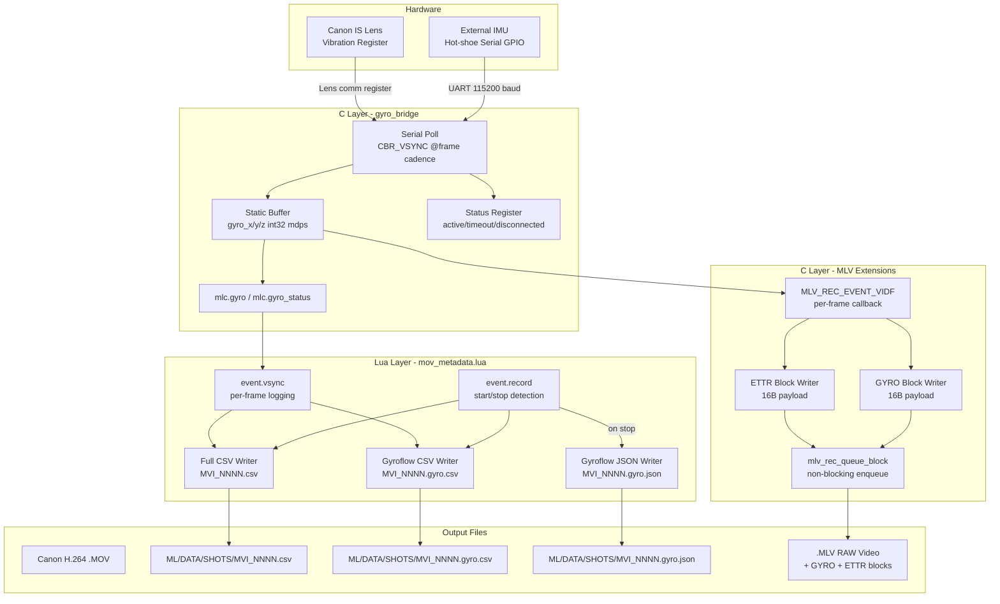
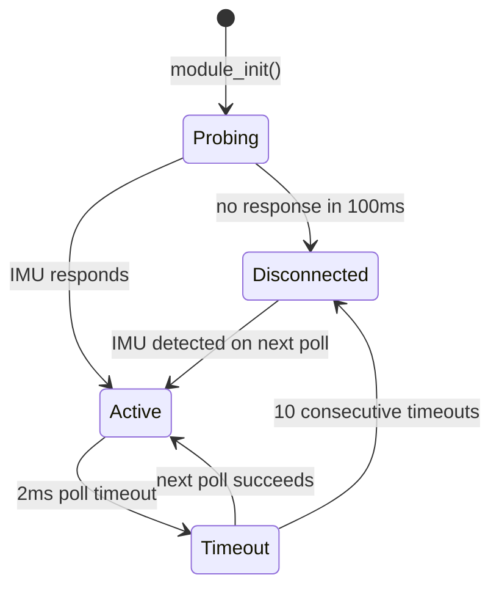

# Design Document: Video Gyro Metadata

## Overview

This feature adds per-frame metadata capture during video recording on the Canon EOS 6D running Magic Lantern. It produces three complementary outputs:

1. **Lua-driven CSV sidecars** alongside H.264 .MOV recordings — full camera state + gyro data at frame cadence, consumed by RaZStudio and colorists.
2. **Gyroflow-native logs** (.gyro.csv + .gyro.json) — pure angular velocity data formatted for direct import into Gyroflow and its NLE plugins (Premiere, Resolve, Final Cut).
3. **MLV block extensions** — GYRO and ETTR blocks embedded in RAW .MLV files, read by MLV post-processing tools without separate sidecar files.

A C-level **Gyro Bridge** exposes external IMU data to Lua via `mlc.gyro()` and to the MLV recorder via a shared static buffer, with optional Canon IS lens vibration readout as an experimental fallback.

### Design Rationale

- **Dual-path architecture** (Lua for MOV, C for MLV): MOV recording is Canon's H.264 pipeline — ML cannot inject blocks into .MOV files. Lua's `event.vsync` provides the only per-frame hook during H.264 recording with access to camera state. MLV recording is ML-native with a block-queue API (`mlv_rec_queue_block`), so metadata embeds directly.
- **Frame-aligned timestamps** (`frame_index / fps`): Eliminates wall-clock jitter from Lua callback timing. Gyroflow expects uniform sample spacing — synthetic timestamps guarantee this.
- **Static allocation throughout**: ARM firmware with limited heap; the gyro bridge and MLV blocks use statically allocated buffers only.
- **Graceful degradation**: Canon 6D has no built-in gyro. The system produces useful non-gyro metadata (ISO, WB, lens, ETTR) when no external IMU is attached.

### Critical Build Prerequisites

| Prerequisite | Current State | Action Required |
|-------------|---------------|-----------------|
| `CONFIG_VSYNC_EVENTS` | **Disabled** (commented out in `lua_common.h:32`) | Uncomment `#define CONFIG_VSYNC_EVENTS` or add to platform CFLAGS. Without this, `event.vsync` never fires — Lua per-frame logging is dead code. |
| `event.record` Lua callback | **Does not exist** | Use `event.shoot_task` + poll `movie.recording` for edge detection (Option A), OR add `PROP_MVR_REC_START` handler in C (Option B). |
| Hot-shoe serial GPIO | **Unverified hardware** | Requires oscilloscope probing of 6D hot-shoe contacts before implementation. Gyro bridge can stub to zeros until confirmed. |
| `CONFIG_ELECTRONIC_LEVEL` | **Enabled** ✓ (platform/6D.116/internals.h:50) | No action — pitch/roll already accessible. |

---

## Architecture

### High-Level Data Flow



### Component Placement

| Component | Location | Runs During |
|-----------|----------|-------------|
| Gyro Bridge (C) | `source-dev/modules/ettr/gyro_bridge.c` + `gyro_bridge.h` | Always (initialized at module load) |
| MLV Block Extensions (C) | `source-dev/modules/ettr/mlv_metadata.c` + `mlv_metadata.h` | MLV recording only |
| MOV Metadata Logger (Lua) | `lua_scripts/mov_metadata.lua` | H.264 .MOV recording only |
| Menu Integration | Within `ettr.c` (C menu entry) + `mov_metadata.lua` (Lua menu) | Always |

**Rationale for ETTR module placement:** The Gyro Bridge lives in the ETTR module because it already owns `ai_lut.h` infrastructure, the Lua C extension (`mlc.*`) namespace, the `CBR_VSYNC` polling loop, and the `ettr_compute_extended_metadata()` function that feeds the ETTR block. No new `.mo` module is needed — the gyro bridge compiles into `ettr.mo`.

---

## Components and Interfaces

### 1. Gyro Bridge (`gyro_bridge.h` / `gyro_bridge.c`)

**Responsibility:** Poll external IMU at frame cadence, maintain latest reading in a static buffer, expose to Lua and MLV writer.

```c
/* gyro_bridge.h */
#ifndef _gyro_bridge_h_
#define _gyro_bridge_h_

#include <stdint.h>

/* Gyro reading in milli-degrees per second (mdps).
 * Valid range: -2,000,000 to +2,000,000 (±2000 deg/s full-scale). */
typedef struct {
    int32_t x;
    int32_t y;
    int32_t z;
} gyro_reading_t;

typedef enum {
    GYRO_STATUS_DISCONNECTED = 0,
    GYRO_STATUS_ACTIVE       = 1,
    GYRO_STATUS_TIMEOUT      = 2,
} gyro_status_t;

/* Initialize the gyro bridge. Probes serial interface.
 * Must be called once at module load. */
void gyro_bridge_init(void);

/* Poll the IMU. Called from CBR_VSYNC (once per frame).
 * Completes within 2ms (timeout) + conversion < 50µs total. */
void gyro_bridge_poll(void);

/* Get the latest reading (non-blocking, <50µs). */
gyro_reading_t gyro_bridge_get(void);

/* Get current status. */
gyro_status_t gyro_bridge_status(void);

/* Lua bindings: mlc.gyro() -> {x, y, z}, mlc.gyro_status() -> string */
int luaCB_gyro(lua_State *L);
int luaCB_gyro_status(lua_State *L);

/* Electronic level bindings: mlc.level() -> {pitch, roll} in degrees
 * Available on all EOS bodies with virtual horizon:
 *   Full-frame: 6D, 5D3, 5D4, 5DS/R, 1DX, 1DX2, 6D2
 *   APS-C: 7D2, 70D, 80D, 77D, 760D, 800D
 *   Mirrorless: M5
 * Reads Canon property PROP_ELECTRONIC_LEVEL (accelerometer-based, ~5 Hz).
 * On bodies without this sensor, returns {0, 0}. */
int luaCB_level(lua_State *L);

#endif
```

**Key design decisions:**
- Static `gyro_reading_t` buffer — single-writer (VSYNC CBR), multi-reader (Lua + MLV writer). No mutex needed: 32-bit aligned int32 reads are atomic on ARM.
- 2ms timeout per poll: if the serial interface stalls, the previous valid reading is retained.
- Probe at init: 100ms window to detect IMU presence, then status settles.

### 2. External IMU Serial Protocol

**⚠️ UNVERIFIED HARDWARE ASSUMPTION:** The hot-shoe serial interface described
below is a design proposal, NOT a confirmed working interface. Canon's hot-shoe
pinout is proprietary. No code in this codebase implements or references hot-shoe
GPIO bit-banging. Before implementation, this requires:
- Oscilloscope/logic analyzer probing of the EOS 6D hot-shoe contacts
- Confirmation that GPIO pins are accessible and not multiplexed with flash comm
- Physical prototype with external IMU board to validate signal integrity
- If hot-shoe proves unusable, fallback is USB-serial via the camera's mini-USB
  port or an SD-card-slot IMU module (both require separate investigation)

```
┌──────────────────────────────────────────────────┐
│ Hot-shoe Serial (bit-banged UART, 115200 8N1)    │
│ STATUS: UNVERIFIED — REQUIRES HARDWARE PROBING   │
├──────────────────────────────────────────────────┤
│ Packet: 12 bytes                                 │
│   [0..1]  gyroX  int16, big-endian, in mdps/10  │
│   [2..3]  gyroY  int16, big-endian, in mdps/10  │
│   [4..5]  gyroZ  int16, big-endian, in mdps/10  │
│   [6..7]  accelX int16 (reserved, ignored)       │
│   [8..9]  accelY int16 (reserved, ignored)       │
│   [10..11] checksum: XOR of bytes 0..9           │
├──────────────────────────────────────────────────┤
│ Scale: multiply int16 value by 10 → mdps         │
│ Rate: IMU sends at >= 100 Hz (we poll 1/frame)   │
│ Pins: hot-shoe contact 4 = RX, contact 2 = GND  │
└──────────────────────────────────────────────────┘
```

### 3. MLV Block Extensions (`mlv_metadata.h` / `mlv_metadata.c`)

**Responsibility:** Register for `MLV_REC_EVENT_VIDF` callback. On each video frame, build and enqueue GYRO and/or ETTR blocks via `mlv_rec_queue_block()`.

```c
/* mlv_metadata.h */
#ifndef _mlv_metadata_h_
#define _mlv_metadata_h_

#include "../raw_video/mlv_rec/mlv.h"
#include "../raw_video/mlv_rec/mlv_rec_interface.h"

/* Custom MLV block: GYRO */
#pragma pack(push,1)
typedef struct {
    mlv_hdr_t hdr;           /* blockType="GYRO", blockSize, timestamp */
    uint32_t  frameNumber;   /* 0-indexed frame counter */
    int32_t   gyroX;         /* milli-degrees/sec */
    int32_t   gyroY;
    int32_t   gyroZ;
} mlv_gyro_hdr_t;            /* sizeof = sizeof(mlv_hdr_t) + 16 */

/* Custom MLV block: ETTR */
typedef struct {
    mlv_hdr_t hdr;           /* blockType="ETTR", blockSize, timestamp */
    uint32_t  frameNumber;   /* 0-indexed frame counter */
    int16_t   sceneDR;       /* 1/100 EV units */
    int16_t   highlightHR;   /* highlight headroom, 1/100 EV */
    uint16_t  clipR;         /* 0–10000 (0.0–1.0 fraction) */
    uint16_t  clipG;
    uint16_t  clipB;
    int16_t   evBias;        /* 1/8 EV units */
} mlv_ettr_hdr_t;            /* sizeof = sizeof(mlv_hdr_t) + 16 */
#pragma pack(pop)

/* Register the MLV recording callback. Call at module init. */
void mlv_metadata_init(void);

#endif
```

**Integration with `mlv_rec`:** The ETTR module calls `mlv_rec_register_cbr(MLV_REC_EVENT_VIDF, ...)` at init. On each VIDF event, the callback allocates a block from a small static pool (not malloc per-frame), fills it, and posts via `mlv_rec_queue_block()`. The queue handles scheduling writes to avoid frame drops.

### 4. MOV Metadata Logger (`mov_metadata.lua`)

**Responsibility:** Log per-frame metadata to CSV/JSON sidecars during H.264 .MOV recording.

#### Critical Platform Prerequisites (Must Be Resolved Before Lua Script Runs)

**Gap 1: `event.vsync` requires `CONFIG_VSYNC_EVENTS` (disabled by default)**

The per-frame Lua callback (`event.vsync`) is gated behind `CONFIG_VSYNC_EVENTS`
in `source-dev/modules/lua/lua_common.h:32`:
```c
//#define CONFIG_VSYNC_EVENTS   /* <-- COMMENTED OUT */
```
And in `lua.c:1437`, `CBR_VSYNC` is only registered if this macro is defined.

**Resolution:** Enable `CONFIG_VSYNC_EVENTS` for the 6D.116 platform:
- Uncomment the define in `lua_common.h`, OR
- Add `-DCONFIG_VSYNC_EVENTS` to the 6D platform's `CFLAGS` in `platform/6D.116/Makefile.platform.default`
- Verify no side effects on other modules (silent.mo, mlv_lite.mo) that may react to `CBR_VSYNC` being registered by lua.mo
- This is a **mandatory build prerequisite** — without it, the Lua per-frame hook never fires

**Gap 2: `event.record` does not exist in ML Lua**

There is no record-start/stop callback in ML's Lua event system. `lua.c` exposes
CBRs for: `PRE_SHOOT`, `POST_SHOOT`, `SHOOT_TASK`, `SECONDS_CLOCK`, `KEYPRESS`,
`CUSTOM_PICTURE_TAKING`, `INTERVALOMETER`, `CONFIG_SAVE`, `VSYNC`, `DISPLAY_FILTER`,
`VSYNC_SETPARAM`. None of these fire on movie record start/stop.

`lua_movie.c` only exposes `movie.start()` / `movie.stop()` as callable actions —
you can trigger recording FROM Lua but cannot be notified BY recording state changes.

**Resolution — Two options (choose one during implementation):**

*Option A (preferred): Poll `is_movie_recording()` from CBR_SHOOT_TASK*
```lua
-- Detect record start/stop by polling movie state each SHOOT_TASK tick
local was_recording = false

function event.shoot_task()
    local now_recording = (movie.recording == true)
    if now_recording and not was_recording then
        on_record_start()
    elseif not now_recording and was_recording then
        on_record_stop()
    end
    was_recording = now_recording
end
```
`event.shoot_task` (CBR_SHOOT_TASK) fires periodically from the shoot task and
IS wired through lua.c. Polling `movie.recording` (or equivalent property) from
this callback gives edge detection with ~100ms latency (acceptable for file open/close).

*Option B: Add a new `CBR_MOVIE_RECORD` in the ETTR module's C code*
Register a property handler for `PROP_MVR_REC_START` (0x80030002) that sets a
global flag, then expose it to Lua via `mlc.movie_recording()`. The Lua script
polls this from `event.shoot_task` or a timer. This is more reliable but requires
C changes beyond the gyro bridge scope.

**Revised Lua Architecture:**
```
event.shoot_task (existing, fires periodically)
  └─ poll movie.recording for edge detection
       ├─ rising edge → open_logs(), set recording=true
       └─ falling edge → close_logs(), set recording=false

event.vsync (requires CONFIG_VSYNC_EVENTS enabled)
  └─ if recording: log_frame() at frame cadence
```

**Fallback if CONFIG_VSYNC_EVENTS causes issues:**
If enabling the vsync event flag has side effects, an alternative is to drive
per-frame logging from `event.shoot_task` itself (lower cadence, ~10-30 Hz instead
of frame-rate, but still produces a usable log). Frame-aligned timestamps would
then use `frame_index / fps` synthetically rather than one-row-per-actual-vsync.

**Key interfaces:**
- `mlc.gyro()` → `{x=int32, y=int32, z=int32}` (mdps)
- `mlc.gyro_status()` → `"active"` | `"timeout"` | `"disconnected"`
- `mlc.level()` → `{pitch=float, roll=float}` (degrees)
- `movie.recording` → boolean (polled for state change detection)
- `camera.iso.raw`, `camera.shutter.raw`, `camera.fps`
- `lens.wb_r`, `lens.wb_g`, `lens.wb_b`, `lens.id`, `lens.focus_distance`
- `dryos.shooting_card.file_number`

**Performance strategy:**
- Pre-allocated 256-byte string buffer for CSV row formatting
- Frame-aligned timestamps (`frame_index / fps`) eliminate clock jitter
- Gyro JSON accumulates in-memory (Lua table), flushed at record stop
- Single `io.write` per frame per file (no intermediate concatenation)

### 5. Menu Integration

| Menu Entry | Parent | Choices | Persistence |
|------------|--------|---------|-------------|
| MOV Metadata | Expo | OFF / ON | ML config (`CONFIG_INT`) |

The Lua script's menu (`menu.new`) is the toggle. The C-level gyro bridge initializes regardless of menu state (it's cheap — just a static buffer) so that MLV recording always has access to gyro data if the IMU is present.

---

## Data Models

### CSV Sidecar Schema (Full Metadata)

```
# schema_version=1.0
# gyro_source=none|external_imu|is_lens
# fps=24.00
timestamp_s,frame,iso,shutter_raw,wb_r,wb_g,wb_b,lens_id,focus_dist,light_level,gyro_x,gyro_y,gyro_z
0.000000,0,800,96,1024,1024,1024,254,650,180,0.012340,-0.004500,0.001200
0.041667,1,800,96,1024,1024,1024,254,650,180,0.013100,-0.003900,0.001500
...
```

- `timestamp_s`: frame_index / fps (seconds, 6 decimal places)
- `gyro_x/y/z`: radians/sec (converted from mdps: `mdps * π / 180000`)
- All numeric, no quoting, LF line endings

### Gyroflow CSV Schema

```
time,gyroX,gyroY,gyroZ,pitch,roll
0.000000,0.012340,-0.004500,0.001200,1.500,-0.300
0.041667,0.013100,-0.003900,0.001500,1.600,-0.200
...
```

- Pure gyro + orientation data
- gyroX/Y/Z in radians/sec (from external IMU or zeros)
- pitch/roll in degrees (from Canon 6D electronic level — always available)
- Frame-aligned time (seconds)
- Gyroflow reads time,gyroX,gyroY,gyroZ for stabilization; ignores extra columns
- RaZStudio reads pitch/roll for horizon correction and AI scene classification

### Gyroflow JSON Schema

```json
{
  "gyro": [
    {"t": 0.000000, "x": 0.012340, "y": -0.004500, "z": 0.001200, "pitch": 1.5, "roll": -0.3},
    {"t": 0.041667, "x": 0.013100, "y": -0.003900, "z": 0.001500, "pitch": 1.6, "roll": -0.2}
  ],
  "fps": 24.0,
  "units": "rad/s",
  "extra": "Canon 6D electronic level metadata"
}
```

- `pitch`/`roll`: degrees, from Canon EOS electronic level (accelerometer-based ~5 Hz, hold-last-value to frame rate). Available on all EOS bodies with virtual horizon (6D, 5D3, 5D4, 7D2, 70D, 80D, 77D, etc.) — not 6D-specific.
- `extra` field: documents the orientation data source
- Gyroflow ignores unknown fields in gyro entries; uses t/x/y/z for stabilization
- On bodies without electronic level, pitch/roll default to 0.0

### MLV GYRO Block Layout

```
Offset  Size    Field           Description
0       4       blockType       "GYRO" (ASCII)
4       4       blockSize       sizeof(mlv_hdr_t) + 16
8       8       timestamp       µs since recording start (set by mlv_rec)
16      4       frameNumber     uint32, 0-indexed
20      4       gyroX           int32, milli-degrees/sec
24      4       gyroY           int32, milli-degrees/sec
28      4       gyroZ           int32, milli-degrees/sec
                                Total: sizeof(mlv_hdr_t) + 16 bytes payload
```

### MLV ETTR Block Layout

```
Offset  Size    Field             Description
0       4       blockType         "ETTR" (ASCII)
4       4       blockSize         sizeof(mlv_hdr_t) + 16
8       8       timestamp         µs since recording start
16      4       frameNumber       uint32, 0-indexed
20      2       sceneDR           int16, 1/100 EV
22      2       highlightHeadroom int16, 1/100 EV
24      2       clipR             uint16, 0–10000
26      2       clipG             uint16, 0–10000
28      2       clipB             uint16, 0–10000
30      2       evBias            int16, 1/8 EV
                                  Total: sizeof(mlv_hdr_t) + 16 bytes payload
```

### State Machine: Gyro Bridge



### Performance Budget

| Operation | Budget | Actual (est.) |
|-----------|--------|---------------|
| `mlc.gyro()` Lua call | <50 µs | ~5 µs (static buffer read) |
| Gyro serial poll | <2 ms | 0.1–2 ms (UART timing) |
| CSV row write (Lua) | <1 ms | ~0.2 ms (buffered I/O) |
| MLV block enqueue | <100 µs | ~10 µs (memcpy + msg_queue_post) |
| Total metadata overhead per frame | <5% of frame period | ~2.5 ms at 24fps (6% of 41.7ms) |
| Card write overhead | <400 bytes/sec | ~360 B/s (GYRO+ETTR blocks @ 24fps) |


---

## Correctness Properties

*A property is a characteristic or behavior that should hold true across all valid executions of a system — essentially, a formal statement about what the system should do. Properties serve as the bridge between human-readable specifications and machine-verifiable correctness guarantees.*

### Property 1: Output File Path Derivation

*For any* file_number in the range 0–9999, the MOV Metadata Logger SHALL produce three file paths:
- `ML/DATA/SHOTS/MVI_{NNNN}.csv`
- `ML/DATA/SHOTS/MVI_{NNNN}.gyro.csv`
- `ML/DATA/SHOTS/MVI_{NNNN}.gyro.json`

where `NNNN` is the zero-padded 4-digit file_number, and all three paths share the same basename as the .MOV file (`MVI_NNNN`).

**Validates: Requirements 1.1, 6.1, 6.5, 6.9**

### Property 2: Frame-Aligned Timestamp Spacing

*For any* frame_index >= 0 and fps ∈ {24, 25, 30, 50, 60}, the timestamp for frame N SHALL equal `N / fps`, and the difference between consecutive timestamps SHALL be exactly `1/fps` (within floating-point epsilon), guaranteeing uniform sample spacing regardless of callback timing.

**Validates: Requirements 2.1, 6.2**

### Property 3: Milli-Degrees-Per-Second to Radians-Per-Second Conversion Round-Trip

*For any* int32 value `mdps` in the range [-2,000,000, +2,000,000], converting to radians/sec via `mdps * π / 180000` and converting back via `rad_s * 180000 / π` SHALL produce a value within ±1 of the original `mdps` (accounting for floating-point rounding).

**Validates: Requirements 6.3**

### Property 4: Gyroflow CSV Row Format Invariant

*For any* gyro reading (three float values), the formatted Gyroflow CSV row SHALL contain exactly 3 comma characters, no quote characters, end with a single LF (`\n`), and each numeric field SHALL be formatted with 6 decimal places.

**Validates: Requirements 6.4**

### Property 5: Gyro Bridge Lua Passthrough

*For any* `gyro_reading_t` {x, y, z} stored in the gyro bridge static buffer, calling `mlc.gyro()` SHALL return a table with fields `x`, `y`, `z` containing the exact same int32 values as the buffer, with no transformation or loss.

**Validates: Requirements 3.1, 3.2, 3.7**

### Property 6: IMU Raw Scaling Range

*For any* int16 raw IMU value received from the serial protocol, the scaled int32 result (raw_value × 10) SHALL be within the valid range [-2,000,000, +2,000,000] mdps, and any raw value whose scaled result would exceed this range SHALL be clamped to the boundary.

**Validates: Requirements 3.6**

### Property 7: Gyro Bridge State Machine

*For any* sequence of poll outcomes (success with data, timeout, no-response), the gyro bridge status SHALL be one of {"active", "timeout", "disconnected"}, and: (a) on timeout, the returned reading SHALL be the last successful reading (or zero if none), (b) the status transitions shall follow: active→timeout on single poll failure, timeout→disconnected on 10 consecutive failures, any→active on successful poll.

**Validates: Requirements 4.2, 4.3**

### Property 8: MLV GYRO Block Binary Round-Trip

*For any* frame_number (uint32) and gyro_reading_t {x, y, z} (int32 each), constructing an `mlv_gyro_hdr_t` and reading back the payload fields at their byte offsets SHALL yield the original frame_number, x, y, and z values unchanged.

**Validates: Requirements 7.3**

### Property 9: MLV ETTR Block Conversion Round-Trip

*For any* valid `ettr_metadata_t` (sceneDR in [4.0, 14.0], highlightHeadroom in [0.0, 3.0], clip channels in [0.0, 1.0], evBias as lens bias in 1/8 EV), constructing an `mlv_ettr_hdr_t` with integer conversions (`sceneDR × 100` → int16, `clip × 10000` → uint16, evBias as-is) and reading back SHALL produce values within ±1 of the integer-converted inputs.

**Validates: Requirements 8.3**

### Property 10: MLV Custom Block Size Invariant

*For any* constructed GYRO or ETTR block, the `blockSize` field SHALL equal `sizeof(mlv_hdr_t) + 16`, and the first 4 bytes SHALL be the ASCII block type ("GYRO" or "ETTR").

**Validates: Requirements 7.4, 8.4, 11.3**

### Property 11: Conditional Block Emission

*For any* video frame during MLV recording: (a) a GYRO block SHALL be enqueued if and only if `gyro_bridge_status() == GYRO_STATUS_ACTIVE`, (b) an ETTR block SHALL be enqueued if and only if the ETTR module is enabled (`auto_ettr != 0`).

**Validates: Requirements 7.5, 8.6, 12.2**

### Property 12: Graceful Degradation — Gyro Zeros with Intact Non-Gyro Data

*For any* camera state (ISO, shutter, WB, lens, focus) when the gyro bridge status is "disconnected", the full CSV row SHALL contain the correct non-zero camera state values in their respective columns AND all three gyro columns SHALL be exactly `0.000000`.

**Validates: Requirements 12.1, 6.8**

---

## Error Handling

### Gyro Bridge Errors

| Condition | Handling | User Feedback |
|-----------|----------|---------------|
| No IMU detected at init | Status → "disconnected", return zeros | None (silent, expected for most users) |
| Serial timeout (single poll) | Status → "timeout", use previous reading | None |
| 10 consecutive timeouts | Status → "disconnected" | None (status queryable via `mlc.gyro_status()`) |
| Checksum mismatch on packet | Discard packet, treat as timeout | None |
| IMU reconnects mid-recording | Status → "active", resume normal operation | None |

### CSV Writer Errors

| Condition | Handling | User Feedback |
|-----------|----------|---------------|
| Cannot open file (card full/RO) | Skip metadata logging for this clip | 3s notification: "MOV Meta: can't open logs" |
| Directory missing | Create `ML/DATA/SHOTS/` | None |
| Write exceeds 1ms | Skip this frame's row | None (silent skip) |
| >10 consecutive skips | Continue logging when I/O recovers | Single notification: "MOV Meta: write degraded" |
| Lua error in callback | ML Lua error handler catches, recording unaffected | Lua error display (standard ML behavior) |

### MLV Block Errors

| Condition | Handling | User Feedback |
|-----------|----------|---------------|
| `mlv_rec_queue_block` unavailable (module not loaded) | Skip all MLV block writes | None |
| Static block pool exhausted | Skip this frame's block | None (next frame retries) |
| MLV recording stops mid-write | Queue drains normally (existing MLV behavior) | None |

### Design Principle

**Never block or delay video recording.** All metadata operations are best-effort. A lost metadata row or block is acceptable; a dropped video frame is not.

---

## Testing Strategy

### Property-Based Testing

Property-based testing is well-suited for this feature because it contains pure functions (timestamp arithmetic, unit conversion, basename derivation, binary block construction, state machine logic) with clear input/output behavior and universal properties.

**Library:** [fast-check](https://github.com/dubzzz/fast-check) (JavaScript/TypeScript) for the Lua logic tests (run off-device against extracted pure functions), and a custom C-based PBT harness using `theft` (C property-based testing library) for the C-layer round-trip and state machine properties.

**Configuration:**
- Minimum 100 iterations per property test
- Each property test tagged with: `Feature: video-gyro-metadata, Property {N}: {title}`

### Unit Tests (Example-Based)

| Test | Validates |
|------|-----------|
| CSV header exact match | Req 1.3, 11.2 |
| Schema version comment present | Req 11.1 |
| Menu entry exists with correct choices | Req 10.1 |
| Menu OFF → no file created | Req 10.2 |
| Disconnected status at init without IMU | Req 12.3 |
| JSON `units` field always "rad/s" | Req 6.7 |
| JSON `fps` matches camera fps | Req 6.6 |
| GYRO block type bytes = "GYRO" | Req 7.2 |
| ETTR block type bytes = "ETTR" | Req 8.2 |
| File open failure → notification + continue | Req 1.5 |

### Integration Tests

| Test | Validates |
|------|-----------|
| Record short .MOV, verify CSV frame count matches duration × fps | Req 1.4 |
| Record MLV with ETTR on, parse GYRO + ETTR block count | Req 7.1, 8.1 |
| Verify GYRO/ETTR blocks interleaved with VIDF in recording order | Req 11.4 |
| Interrupt recording (power kill sim), verify partial CSV is valid | Req 1.4 |
| Performance: CSV write latency < 1ms across 1000 frames | Req 9.1 |
| Performance: mlc.gyro() call < 50µs | Req 3.4 |

### Test Execution

- **Off-device (CI):** Property tests + unit tests run on the build machine. Pure functions extracted from the Lua script and C modules are testable without camera hardware.
- **On-device (field):** Integration tests require camera + SD card. Run via the ML console or automated test scripts on D:\.
- **Hardware-dependent:** IMU serial tests require the external IMU board connected. These are manual validation tests documented in `docs/FIELD_LOGGING_CHECKLIST.md`.
